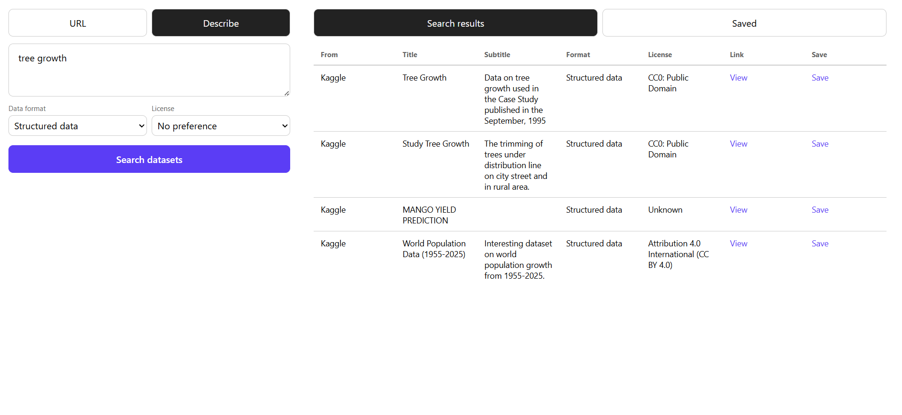
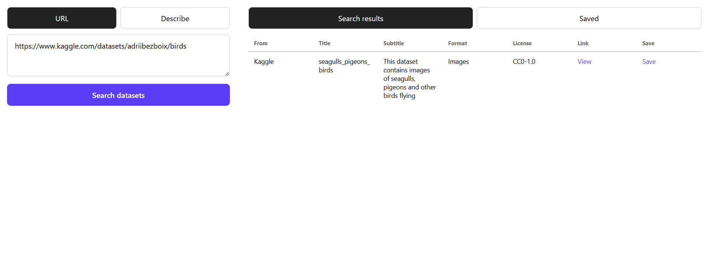
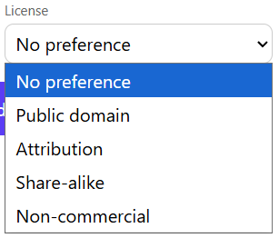

# Data Audit

Finding the right Kaggle dataset is often harder than building with it, especially when you do not know the exact keywords Kaggle expects. This project lets you describe your project in plain English, then uses an LLM to generate an effective Kaggle search query and semantic ranking to surface the datasets that best match your actual intent. You can also inspect a specific dataset by pasting its Kaggle URL.

As of now it can only return Kaggle's database, but the system is code-friendly for introducing more databases.

## Demo

https://data-audit.onrender.com/

Takes a bit of time to run the first time, since it's running on free version of Render, so be patient.

## Tech Stack
### Frontend

- React
- Vite

### Backend

- Python
- FastAPI
- Pydantic
- Groq API
- sentence-transformers
- SQLAlchemy
- Uvicorn
- python-dotenv

### DevOps

- Docker
- Docker Compose
- Render
- PostgreSQL

## Features

- Describe a project in plain English and get relevant Kaggle datasets back
- Paste a Kaggle dataset URL to look up that exact dataset
- LLM-powered query refinement (Groq), which turns a description into a short search phrase
- Automatic broader-search fallback when the specific query finds nothing
- Semantic relevance ranking to filter out irrelevant results
- Filter results by data format
- Filter results by license category
- Save datasets to a list and remove them later
- Error handlers
- Render deployment

## Screenshots

# Describing a database

# Kaggle's URL

# Choosing data format

# Choosing license

## What could be improved

- More dataset sources.
- Cache results, which could help the latency problems.